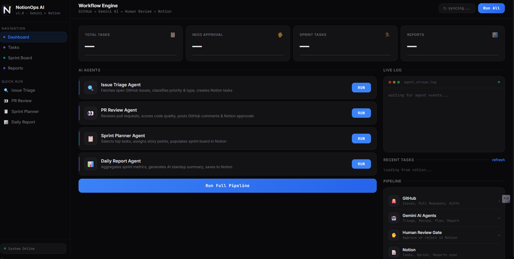
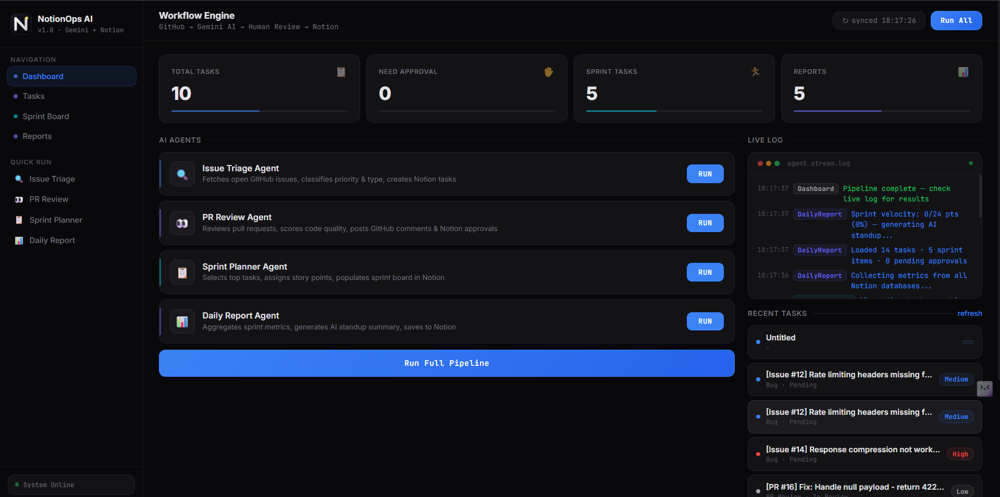
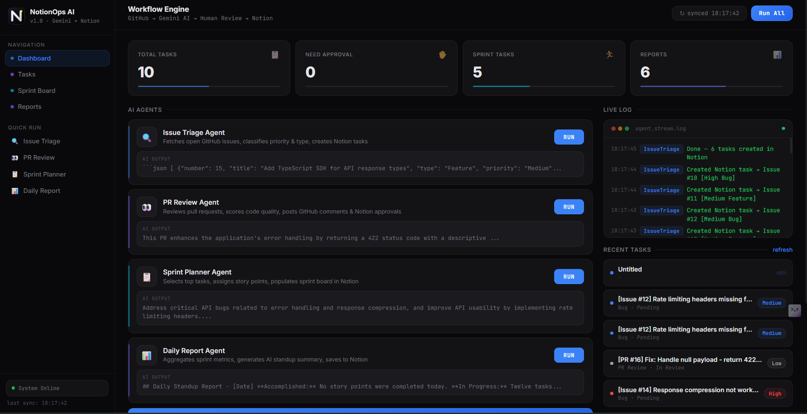
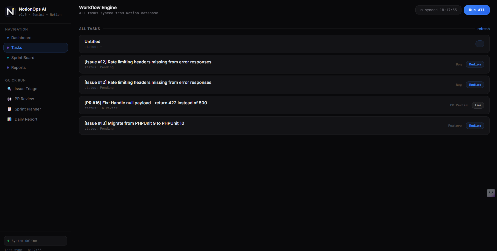
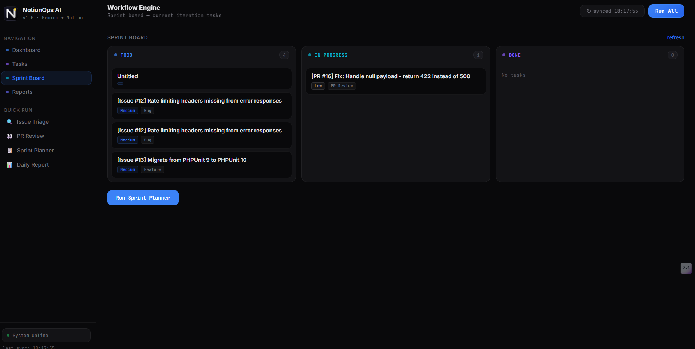
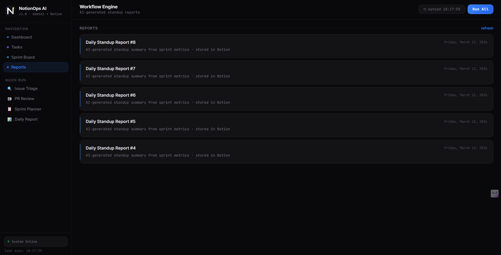
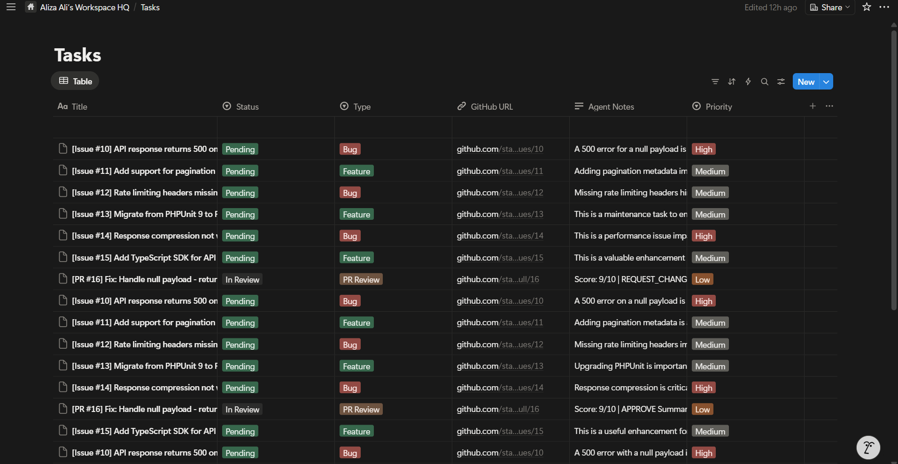
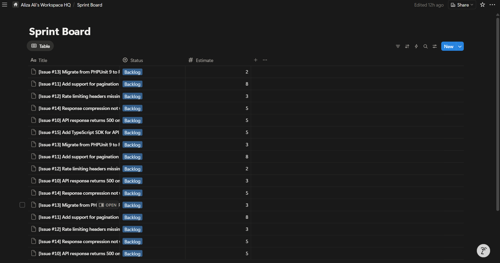
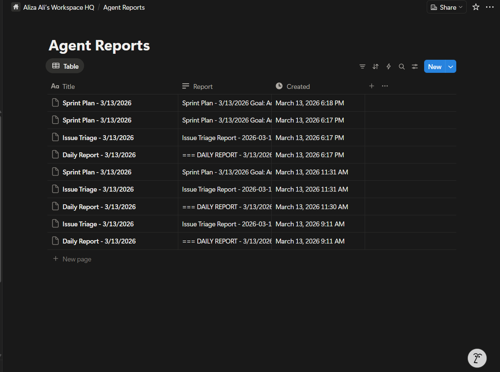

# NotionOps AI — Software Dev Pipeline That Runs Itself 🤖

> **Notion MCP Challenge Submission** — An autonomous AI workflow engine that closes the loop between GitHub, OpenAI, human judgment, and Notion — in real time.

---

## What It Does

Most dev teams have a painful daily ritual: check GitHub for new issues, triage them manually, review PRs, update Notion, plan the sprint, write the standup. **NotionOps AI eliminates every step of that with four specialized AI agents** and a real-time neon dashboard.

```
GitHub Issues/PRs  →  OpenAI Agents  →  Human Review Gate  →  Notion (Tasks · Sprint · Reports)
        ↑                                           |
        └───────────── feedback loop ───────────────┘
```

One click. The pipeline runs itself.

### Demo Video

[](https://youtu.be/_Ksiqn_yz4s)

---

## Four AI Agents

| Agent | What it does | Output |
|-------|-------------|--------|
| 🔍 **Issue Triage** | Fetches all open GitHub issues, classifies each as Bug/Feature/Issue with High/Medium/Low priority | Notion task per issue + triage report |
| 👀 **PR Review** | Reviews every open PR, scores code quality 1–10, posts a detailed AI comment on GitHub | GitHub comment + Notion task + human approval request if score < 6 |
| 📋 **Sprint Planner** | Picks the top 6 tasks from Notion backlog, assigns Fibonacci story points, sets the sprint goal | Sprint board populated in Notion + sprint report |
| 📊 **Daily Report** | Aggregates metrics across all databases, calculates velocity, generates a PM-quality standup | Notion report page with AI summary + raw metrics |

---

## What Makes This Different

**vs. every other submission:**

- **Bidirectional sync** — Data flows *both ways*: GitHub → Notion AND Notion → GitHub (AI posts review comments directly on PRs)
- **Human-in-the-loop gate** — PRs that score < 6 automatically create approval requests in Notion before any action is taken. Humans stay in control.
- **Real-time SSE streaming** — The dashboard uses Server-Sent Events to stream every agent log line live as it happens. Watch the AI think in real time.
- **Chained pipeline** — Agents are designed to chain: Triage creates tasks → Sprint Planner picks them → Daily Report summarizes progress. One click runs the full lifecycle.
- **AI output preview** — Each agent card shows the actual AI-generated content (sprint goal, review summary, standup copy) directly in the dashboard.

---

## Architecture

```
┌─────────────────────────────────────────────────────────────┐
│                    Express.js Server                         │
│                                                             │
│  GET  /           → Neon dashboard (SSE-powered)            │
│  GET  /events     → SSE stream (real-time agent logs)       │
│  GET  /api/stats  → Live Notion database metrics            │
│  POST /run/:agent → Trigger individual agent                │
└────────────┬────────────────────────────────────────────────┘
             │
    ┌────────┴────────┐
    │  Event Emitter  │  ← agents emit structured events
    └────────┬────────┘
             │ broadcasts to all SSE clients
    ┌────────┴──────────────────────────────┐
    │           4 AI Agents                 │
    │  ┌──────────────┐ ┌────────────────┐  │
    │  │ IssueTriage  │ │   PRReview     │  │
    │  │  GitHub API  │ │  GitHub API    │  │
    │  │  OpenAI      │ │  Gemini AI     │  │
    │  │  Notion API  │ │  Notion API    │  │
    │  └──────────────┘ └────────────────┘  │
    │  ┌──────────────┐ ┌────────────────┐  │
    │  │SprintPlanner │ │  DailyReport   │  │
    │  │  Notion API  │ │  Notion API    │  │
    │  │  OpenAI      │ │  Gemini AI     │  │
    │  └──────────────┘ └────────────────┘  │
    └───────────────────────────────────────┘
             │
    ┌────────┴─────────────────────────────────────┐
    │              Notion Workspace                 │
    │  📋 Tasks DB   🏃 Sprint DB   📊 Reports DB  │
    │               ✋ Approvals DB                 │
    └──────────────────────────────────────────────┘
```

---

## Tech Stack

- **Runtime**: Node.js + TypeScript (strict)
- **AI**: OpenAI via OpenRouter (structured JSON outputs)
- **Project management**: Notion API (`@notionhq/client`)
- **Source control**: GitHub REST API (Octokit)
- **Server**: Express.js with SSE for real-time streaming
- **UI**: Vanilla HTML/CSS/JS — clean dark theme, zero dependencies

---

## Setup

### 1. Clone & install
```bash
git clone https://github.com/stackmasteraliza/notionops-ai.git
cd notionops-ai
npm install
```

### 2. Configure environment
```bash
cp .env.example .env
```

Fill in `.env`:
```env
NOTION_API_KEY=secret_...
NOTION_TASKS_DB_ID=...
NOTION_APPROVALS_DB_ID=...
NOTION_SPRINT_DB_ID=...
NOTION_REPORTS_DB_ID=...

OPENROUTER_API_KEY=sk-or-v1-...

GITHUB_TOKEN=ghp_...
GITHUB_REPO_OWNER=your-org
GITHUB_REPO_NAME=your-repo
```

### 3. Set up Notion databases

Create four databases in Notion with these properties:

**Tasks DB**: Title (title), Status (select: Pending/In Review/Done), Type (select: Bug/Feature/Issue/PR Review), Priority (select: High/Medium/Low), GitHub URL (url), Agent Notes (rich_text)

**Approvals DB**: Title (title), Status (select: Waiting/Approved/Rejected), Agent Recommendation (rich_text)

**Sprint DB**: Title (title), Status (select: Todo/In Progress/Done), Estimate (number)

**Reports DB**: Title (title), Report (rich_text)

### 4. Run

```bash
# Start the dashboard (http://localhost:3000)
npm run dev

# Or run individual agents from CLI
npm run triage
npm run pr-review
npm run sprint-plan
npm run daily-report
npm run run-all
```

---

## The Dashboard

The real-time dashboard at `http://localhost:3000` gives you:

- **Live stat counters** with animated count-up and progress bars
- **Agent cards** with one-click run, live progress bar, and AI output preview
- **SSE terminal** streaming every agent log line in real time with color-coded agent labels
- **Pipeline visualization** highlighting which stage is currently active
- **Recent tasks** from Notion with priority-coded badges
- **Run Full Pipeline** button that chains all four agents in sequence




### Views

| Tasks | Sprint Board | Reports |
|-------|-------------|---------|
|  |  |  |

### Notion Integration

| Tasks Database | Sprint Board | Agent Reports |
|---------------|-------------|---------------|
|  |  |  |

---

## The Human-in-the-Loop Design

NotionOps AI never takes destructive action without human sign-off. When the PR Review Agent finds a low-quality PR (score < 6), it:

1. Creates a task in Notion with full AI analysis
2. Posts an AI review comment on the GitHub PR
3. Creates a separate **Approval Request** in the Notion Approvals database
4. Pauses — a human must approve before anything else happens

This is enterprise-grade AI safety baked into the core design.

---

---

*Built for the [Notion MCP Challenge](https://dev.to/challenges/notion-2026-03-04) — March 2026*
